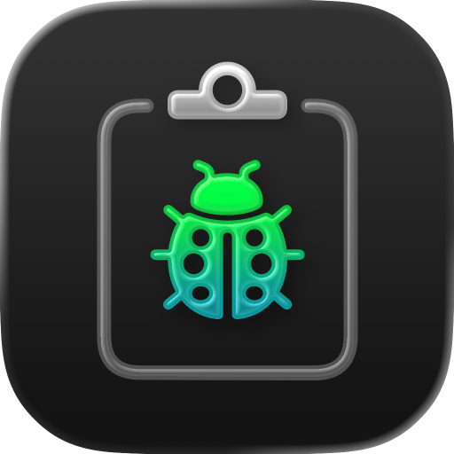
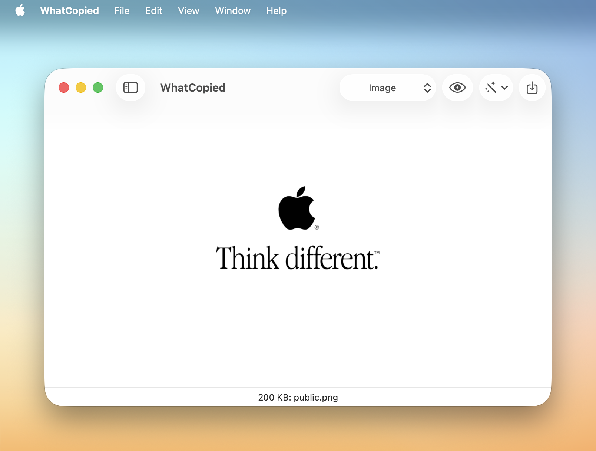

# WhatCopied

  

The ultimate pasteboard debugger for macOS developers.

> [!TIP]
> Discover our other free and open-source apps at [libremac.github.io](https://libremac.github.io/).

## Installation

Get `WhatCopied.dmg` from the <a href="https://github.com/WhatCopied-app/WhatCopied/releases/latest" target="_blank">latest release</a>, open it and drag `WhatCopied.app` to `Applications`.

WhatCopied checks for updates automatically. You can also check manually via the main `WhatCopied` menu, or browse version history [here](https://github.com/WhatCopied-app/WhatCopied/releases).

## Why WhatCopied

Apple provides a developer tool called **Clipboard Viewer**, included in the "Xcode Additional Tools", which you can download [here](https://developer.apple.com/download/all/?q=Additional%20Tools).

It works well but has some limitations. Here's how **WhatCopied** improves upon the official Clipboard Viewer:

- [x] Unicode support
- [x] Modern UI with dark mode
- [x] Well-designed app icon
- [x] Human-friendly and UTI-aware type names
- [x] Automatic refresh
- [x] Renderers for HTML, RTF, and images
- [x] Syntax highlighting for source code
- [x] Quick Look integration
- [x] Faster hexadecimal viewer

Also, **WhatCopied** is an open-source project built with the latest Apple ecosystem technologies, unlike Apple's Clipboard Viewer, which has not been maintained for nearly a decade.

Hope you find this tool helpful—happy hacking!
